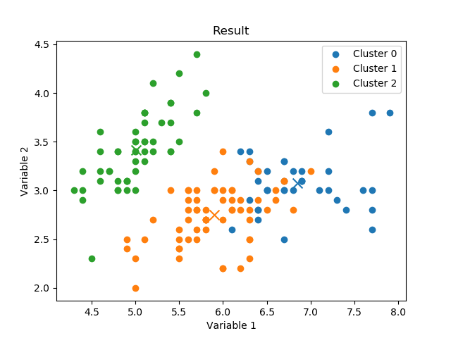

# Grupo10SemanaTec
Repostorio para analizar el database de Iris utilizando machine learning
a través de clusters y la técnica de K-means

Dentro del repositorio se pueden encontrar tres archivos py para realizar
realizar el k_means, cada uno tiene una función distinta pero se conectan
de regreso al correr k_means.py

## io_utilities.py
Este archivo se usa para formatear la base de datos en la forma de una lista de
listas

## visualizations.py
Este archivo grafica los clusters y los centros en un momento particular
También salva las graficas en formato de imágen png dentro de un folder

## k_means.py
Este archivo implementa la técnica de k-means a través de varias funciones

### distancia
La función distancia encuentra la métrica de distancia euclidiana entre los puntos y los centros

### cercanos
La función cercanos encuentra cual centro está más cerca de cada punto y los organiza en una lista correspondiente

### find_centros
La función find_centros crea una lista y la llena con los promedios de cada fila de los clusters

### k_means
La función k_means genera k (cantidad de clusters) centros aleatoriamente utilizando los puntos
Esta función también corre todas las iteraciones, actualizando los centros y puntos correspondientes cada vez, llamando a la función show_clusters_centroids de visualizations.py para graficarlo en cada iteracion

#### Como correr
Para correr el código simplemente es necesario descargar el repositorio y correr el archivo k_means.py esto resulta en las graficas de todas las iteraciones

## Resultados
Utilizando un valor de k de 3, resulta en los siguientes clusters

Si se utiliza un valor de k de 2, los resultados cambian drasticamente

Finalmente, modificando el valor de k a ser 4, el resultado cambia de nuevo

## Conclusiones

Analizando los datos de Iris utilizando K-means se puede entender algunas cosas sobre Iris, particularmente analizando ciertos variables y los centros de los clusters.

Los centros pueden representar alguna forma del promedio de las instancias de las clases de Iris, ya que tienen la menor distancia a los otros miembros del mismo cluster

Los clusters cambian drasticamente con distintos valores de k, como resultado, saber cual valor usar depende de experimentación y los data sets siendo analizados. En el caso de Iris, el valor de k que nosotros creemos más útil para analizar fue tres, ya que vimos los casos de 2 y 4 y por lo general creemos que resultan clusters con demasiados puntos o muy poquitos en comparación. Al igual, Iris tiene tres clases entonces simplemente se puede elegir k como 3 por consecuencia.

Los centros se vuelven más representativos con valores de k más altos, ya que son puntos más y más cercanos al centro los que se acumulan dentro del cluster, a diferencia de un valor de k que agrupa a puntos más y más lejanos junto con los centros.

Los centros tienen una distancia considerable entre si, no totalmente a lados contrarios pero suficiente para no considerarlos cercanos entre si. Los centros más cercanos son los dos que se encuentran con el grupo de puntos grande en la parte inferior hacia la derecha de las imágenes, pero aún así existe una distancia entre ellos.

Los centros son vitales para el análisis de los clusters, y analizando su posición se puede entender más sobre las distintas clases presentes en el dataset de Iris. Puede uno entender que ciertos rangos de cada variable son más presentes en ciertas clases, es decir, el sepal length de 5 y sepal width de 3.5 suele corresponder a una clase, mientras los mismos de 5.7 y 2.7 son más comunmente vistos en otra clase.
